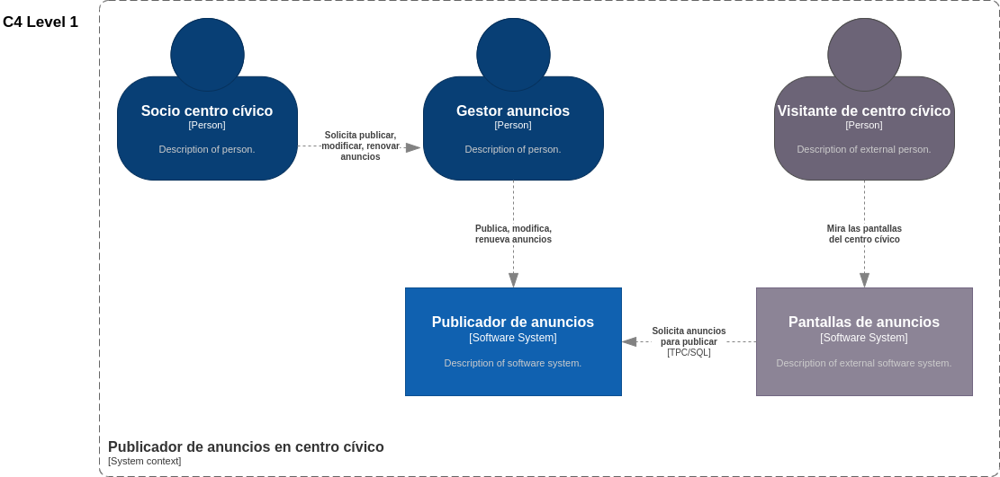
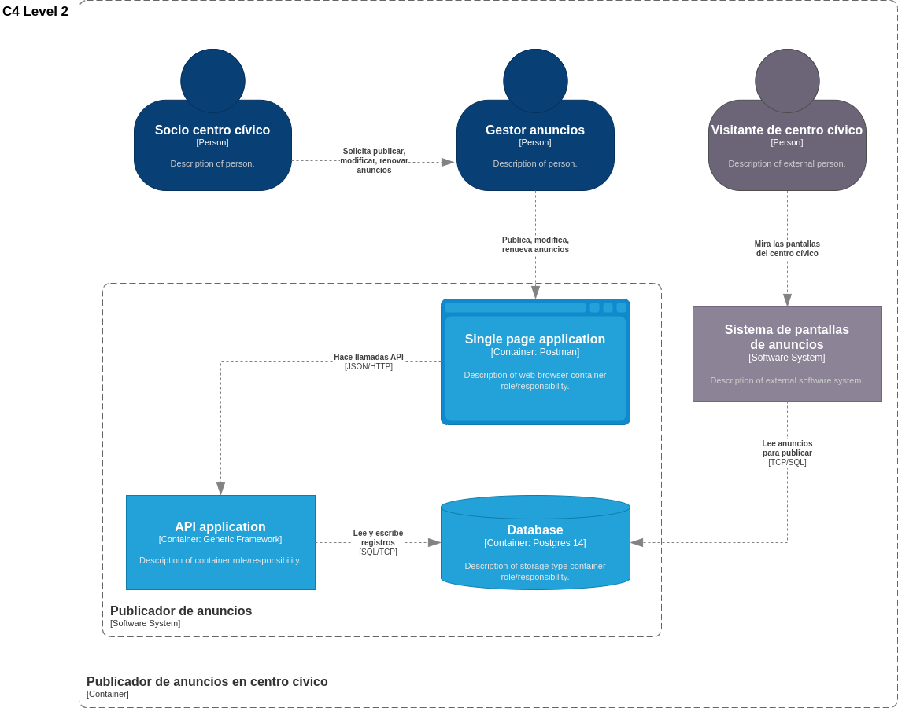
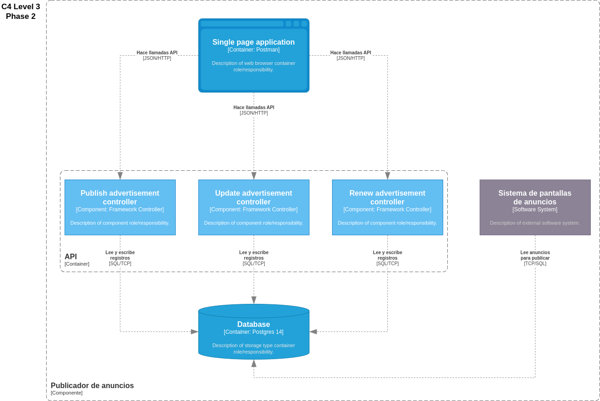

# Aprende DDD paso a paso, usando las cartas de "The DDD universe"

En esta serie de workshops trabajaremos sobre un código muy básico y llano. 
Deberemos enfrentarnos a pequeños retos para pasarlo a una estructura más acorde con los estándares actuales de DDD.

## Escenario

Somos una startup que quiere recuperar la simplicidad de publicar anuncios imitando como se hacía antaño. 
Antes se pegaban carteles en las calles o en tablones de anuncios publicitando cosas. Nuestra startup quiere recuperar esa idea pero en un formato digital. Ahora existen paneles digitales en los centros cívicos y tenemos un acuerdo para publicar en ellos.

Empezamos la prueba de concepto con un centro cívico cercano a nuestras oficinas.

## Problema
Ya hemos refactorizado a arquitectura hexagonal, que le sucede ahora es que nos han comentado que los passwords que guardamos en base de datos tienen un cifrado débil y por temas legales debemos actualizar nuestro desarrollo.

Como los anuncios tienen un cifrado, aunque sea débil, no podemos actualizarlos todos, con lo que como solución de compromiso haremos lo siguiente.

- Sabemos que cada mes se debe renovar el anuncio introduciendo el identificador y password.
- También sabemos que en ocasiones se pide modificar la información del anuncio, y en esos casos también usamos el password.
- Aprovecharemos ese momento y cambiaremos el password obsoleto por el nuevo con un cifrado más robusto.

Estudia el código y comenta con tus colegas la forma más fiable de abordar este problema.

## Hacia una solución

Mirando cómo hacerlo, creemos que la mejor forma es encapsular la lógica en un "Value Object" para lidiar con esta casuística.

## Tenemos un aliado. Tests e2e en nuestra API

Por suerte disponemos de tests que verifican el resultado final de nuestra API, con lo que podemos refactorizar con calma nuestro código.
En este caso, la persona que desarrollaba la solución sólo pudo hacer los tests E2e antes de irse de vacaciones sin implementar la solución. Deberemos implementarlo nosotros y hacer que los tests pasen en verde.

### [Guión para facilitadores](doc/es/el-poder-de-los-value-objects.md)
