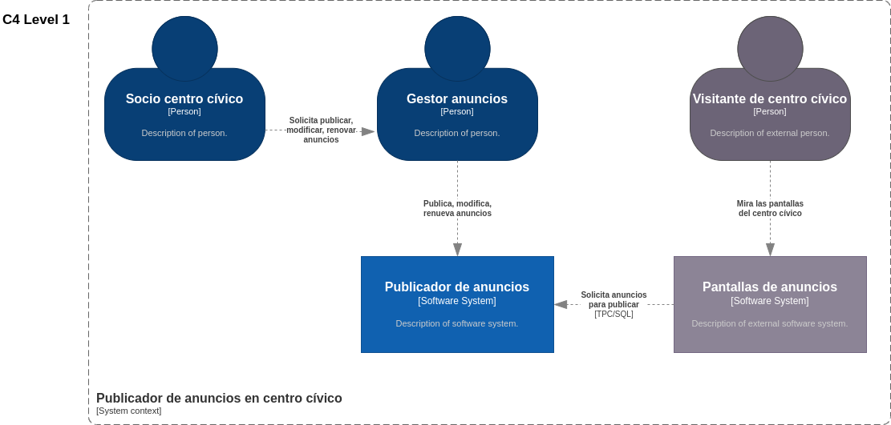

# Learn DDD Step by Step, Using "The DDD Universe" Cards

In this series of workshops, we will be working on a very basic and plain code. We will face small challenges to transform it into a structure more in line with the current DDD standards.

## Scenario

We are a startup that wants to bring back the simplicity of posting ads, imitating how it was done in the past. Previously, posters were glued on the streets or on bulletin boards advertising things. Our startup wants to revive that idea but in a digital format. Now, there are digital panels in civic centers, and we have an agreement to publish on them.

We started the proof of concept with a civic center near our offices.

## Problem
We have already refactored to hexagonal architecture, what is happening now is that we have been told that the passwords that we keep in the database have weak encryption and for legal reasons we must update our development.

As the ads have encryption, even if it is weak, we cannot update all of them, so as a compromise solution we will do the following.

- We know that each month the advertisement must be renewed by entering the identifier and password.
- We also know that sometimes it is requested to modify the information in the advertisement, and in those cases we also use the password.
- We will take advantage of that moment and change the obsolete password with the new one with more robust encryption.

Study the code and discuss with your colleagues the most reliable way to address this problem.

## Towards a solution
Looking at how to do it, we think the best way is to encapsulate the logic in a "Value Object" to deal with this situation.

## We have an ally. E2E tests in our API

Luckily we have tests that verify the final result of our API, so we can calmly refactor our code.
In this case, the person developing the solution could only do the E2E tests before going on vacation without implementing the solution. We will have to implement it ourselves and make the tests pass green.

### [Facilitator's script](doc/en/the-power-of-value-objects.md)
