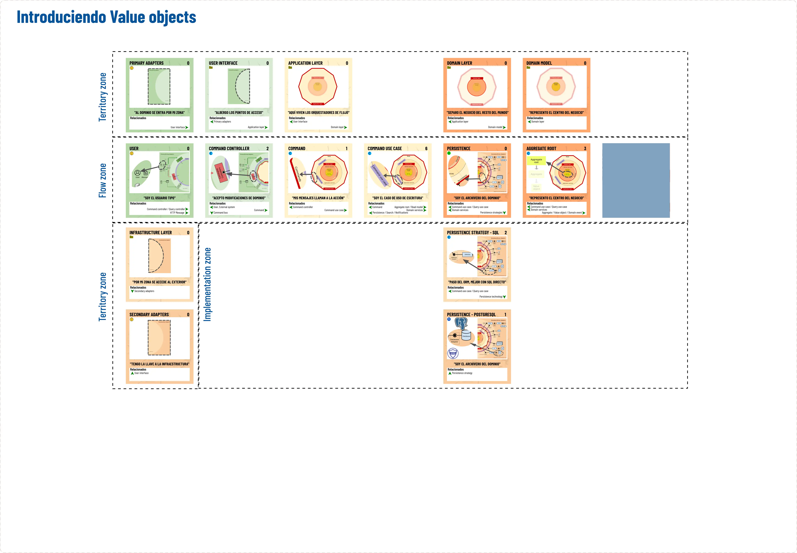

# Learn DDD Step by Step, Using "The DDD Universe" Cards

## The power of "Value objects"

## Starting point

### Recapitulation

  
<b>Click to expand</b>

### Dynamics

We will show attendees a brief presentation talking about the benefits of DDD and its objective.

Next, we will give them access to the repository and explain the key points.

- It's flat code
- Simulates a framework
- There are controller-level tests to ensure that nothing breaks

### Slides

[Here](https://docs.google.com/presentation/d/1QvEjYzJK5hzxI8v3u4s0mHVenjLNLwSrk1HrDsH0HKg/edit?usp=sharing) you can access the slides content.

### Dinámica

### [Actividad en Canva](https://www.canva.com/design/DAF7elKV4EQ/pISuZ-a_RsIv5bx6y_Ujtw/view?utm_content=DAF7elKV4EQ&utm_campaign=designshare&utm_medium=link&utm_source=publishsharelink&mode=preview)

- To begin with, we assume that the layers are those of the drawing and its distribution. We will ask them to imitate that figure with their letters. Leaving the covered cards unplaced.
- We present the Value object and its characteristics

## Final Solution

  
<b>Click to expand</b>

## Interactive activity

### Phase 1: Learning to identify a value object

The objective is to identify if the code that we will see is a Value object and if it meets the specifications of the card that defines it.

#### [Value object or not](https://theddduniverse.com/game-cards/cards/primary/value-object/#actividad-value-object-o-no)

### Phase 2: Responsibility cards

  
<b>Click to expand</b>

## Final solution: Responsibility Cards

  
<b>Click to expand</b>

### Phase 3: Preparation of the solution

- We explain the problem
- We will look at how it is in the initial project
- We ask the public to think a solution
- We suggest a plan in which the person in charge of managing the complexity of passwords is a Value Object.

### Phase 4: We review code and present a solution

- We offer the solution in the solution branch

