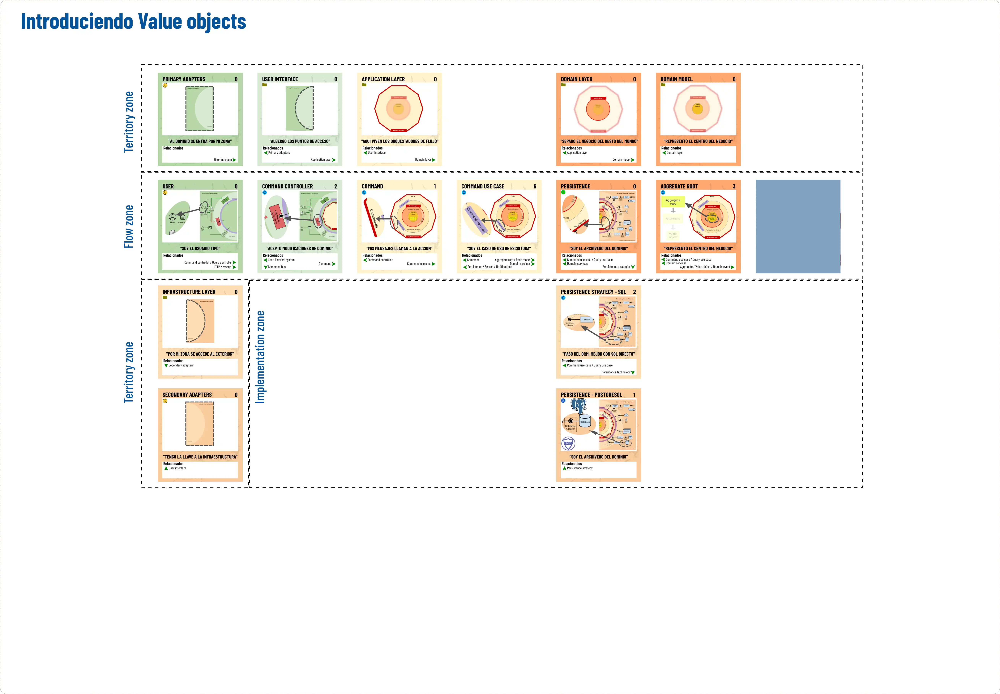
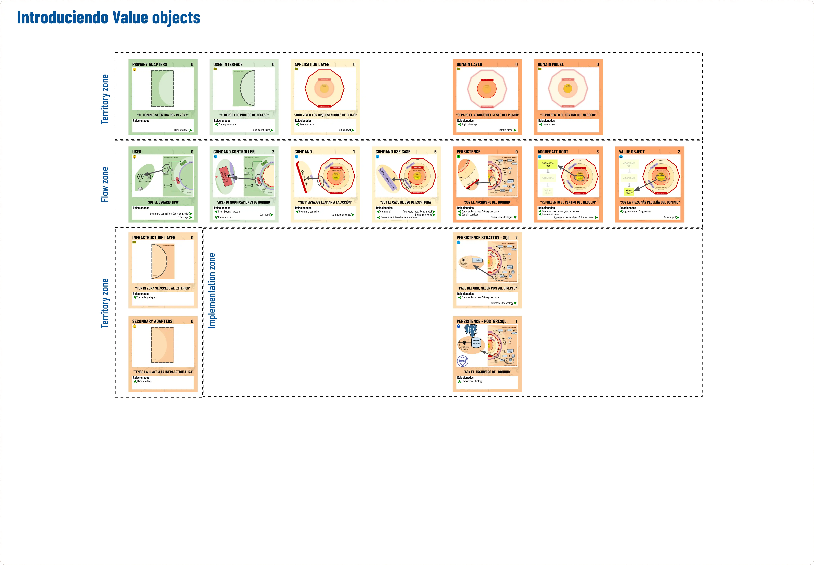
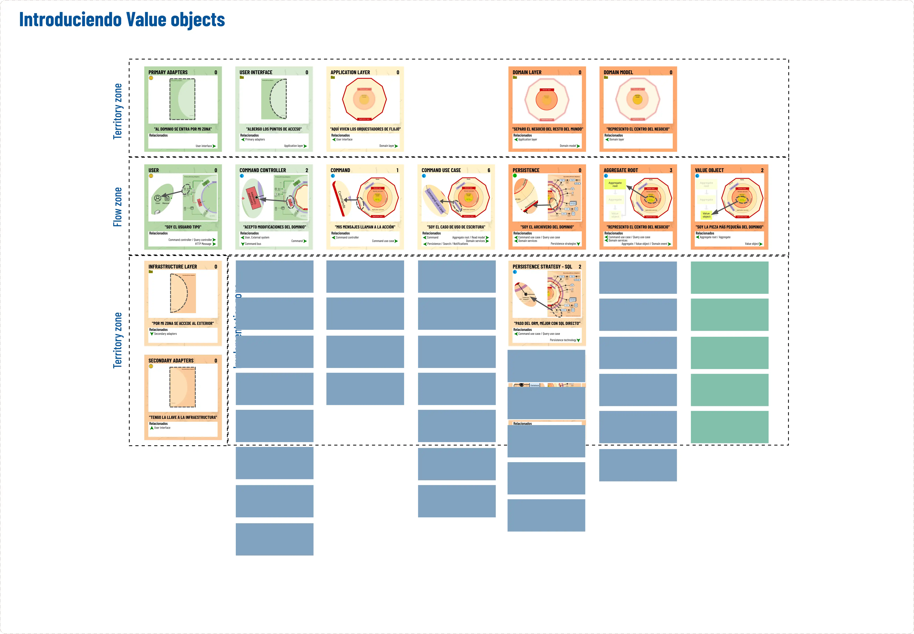
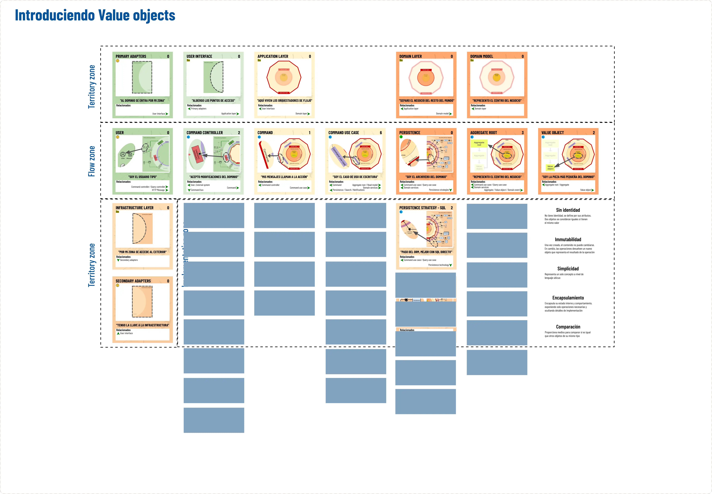

# Aprende DDD paso a paso, usando las cartas de "The DDD universe"

## El poder de los "Value objects"

## Punto de partida

### Recapitulación

<details>
  <summary><b>Click para expandir</b></summary>

Mostraremos a los asistentes una pequeña presentación hablando de los beneficios de DDD y su objetivo.

Acto seguido, les daremos acceso al repositorio y les explicamos los puntos clave.

- Es código plano
- Simula un framework
- Hay tests a nivel de controlador para asegurar que no rompemos nada

```
TODO: Link a presentación.
```
</details>

### Dinámica

### [Actividad en Canva](https://www.canva.com/design/DAF6VDIfdkE/jBve6kYf6zX9ly9tyEToNA/edit?utm_content=DAF6VDIfdkE&utm_campaign=designshare&utm_medium=link2&utm_source=sharebutton)

- Para empezar, damos por sentado que las capas son las del dibujo y su distribución. Les pediremos que imiten con sus cartas esa figura. Dejando sin colocar las cartas tapadas.
- Presentamos el Value object y sus características



## Solución al tablero

<details>
  <summary><b>Click para expandir</b></summary>


</details>

## Actividad interactiva

### Fase 1: Aprendiendo a identificar un value object

El objetivo es identificar si el código que veremos es un Value object y si cumple las especificaciones de la carta que lo define.

#### [Value object o no](https://theddduniverse.com/game-cards/cards/primary/value-object/#actividad-value-object-o-no)

### Fase 2: Preparación de la solución

- Explicamos el problema
- Le pedimos al público que busque una solución al mismo
- Sugerimos un plan en el que el encargado de manejar la complejidad de los passwords sea un Value Object

### Fase 3: Dinámica con código

- Hablaremos de los requerimientos y el código.
- Miraremos cómo está en el proyecto inicial y en el distribuido en Arquitectura hexagonal.

### Fase 4: Revisamos código y presentamos solución

- Ofrecemos la solución en la rama solution

## Actividad: Tarjetas de responsabilidad

<details>
  <summary><b>Click para expandir</b></summary>


</details>

## Solución final: Tarjetas de responsabilidades

<details>
  <summary><b>Click para expandir</b></summary>


</details>
